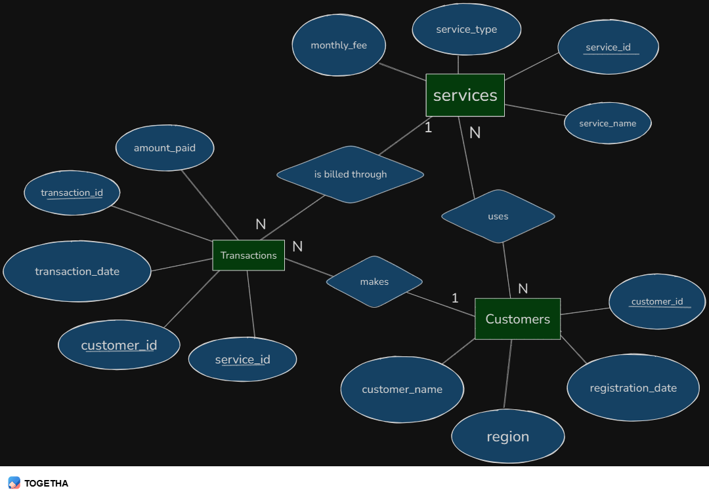
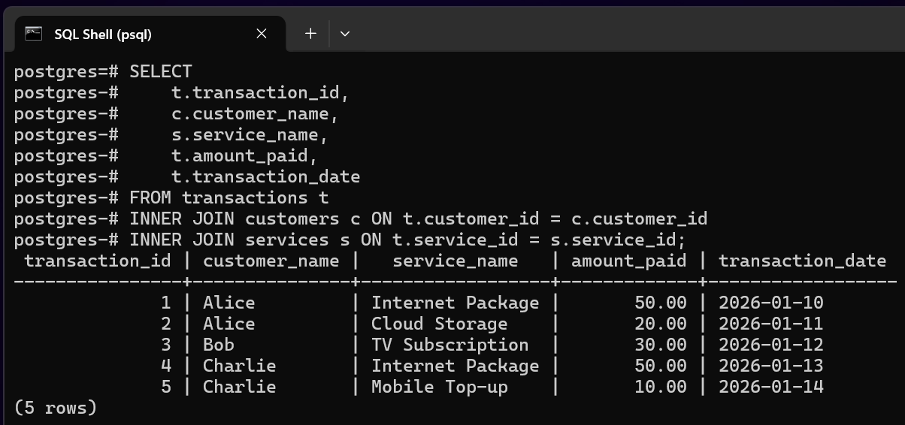
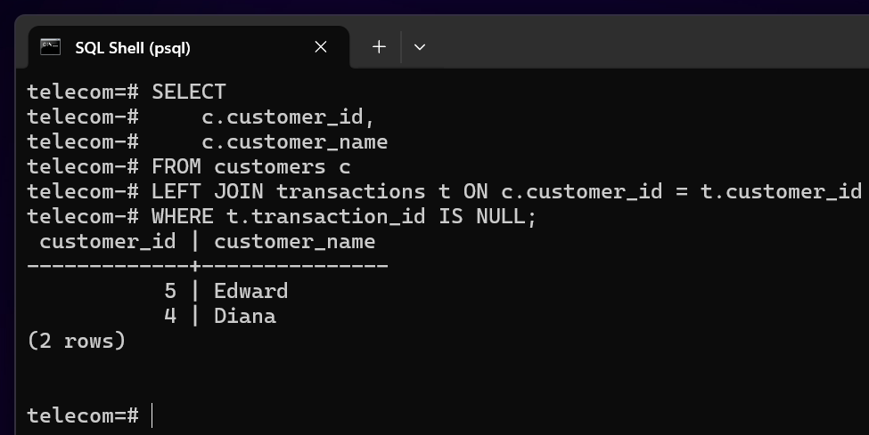
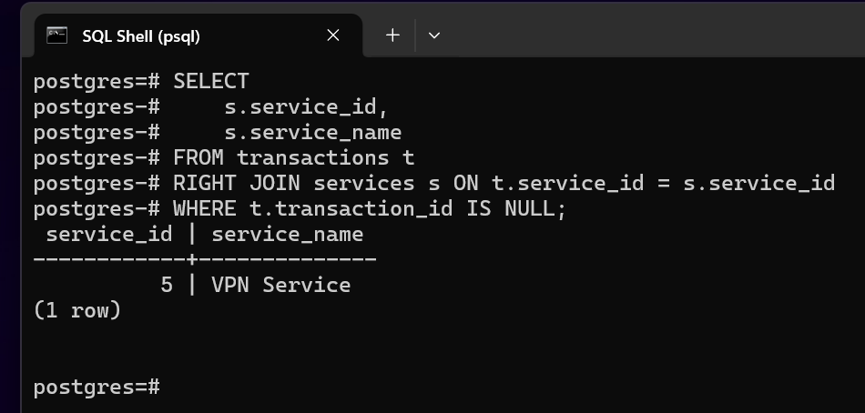
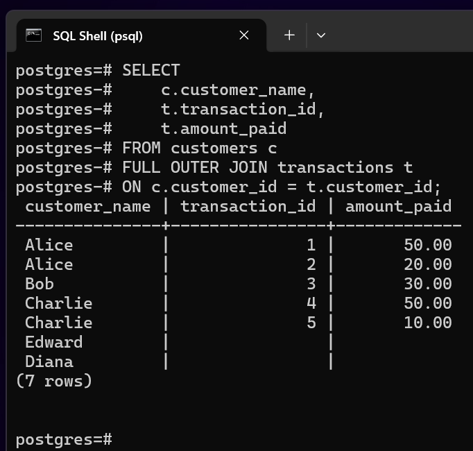
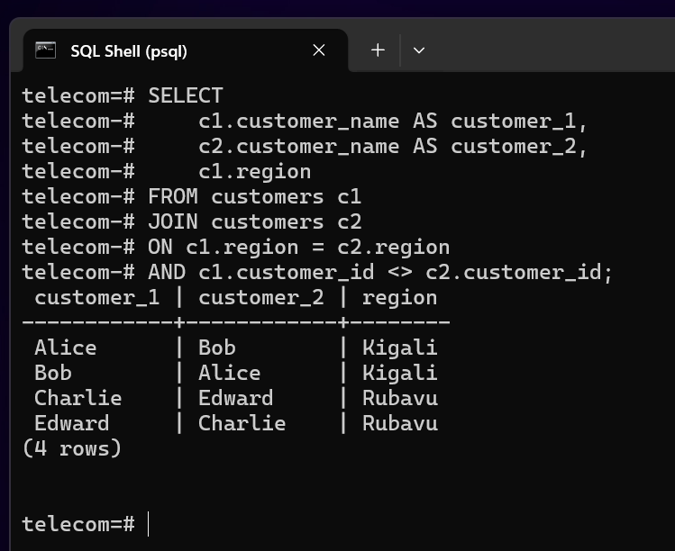
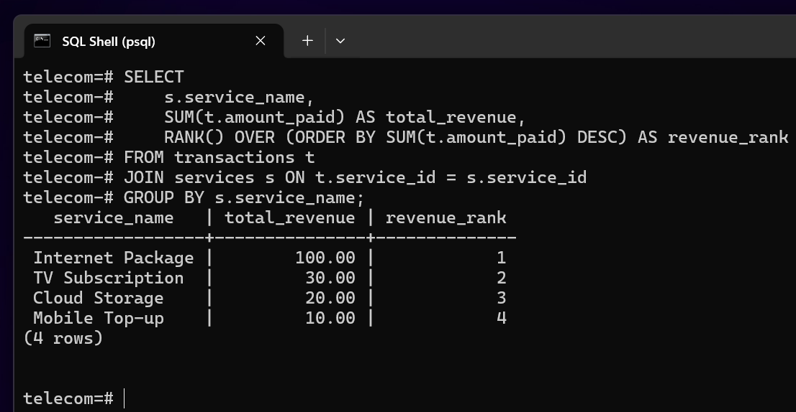
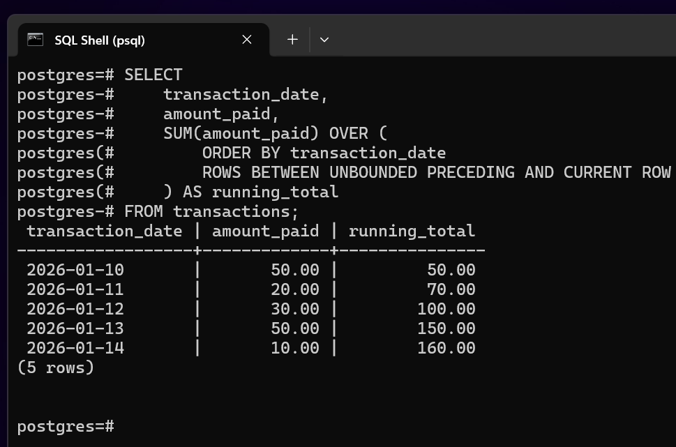
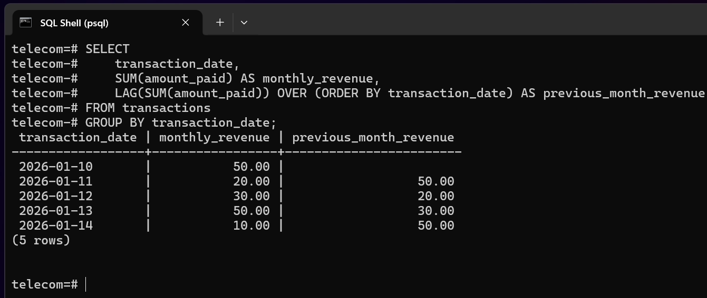
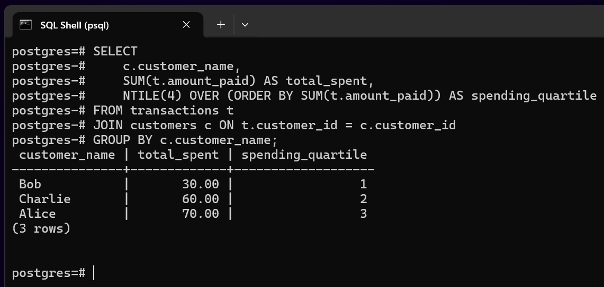

# SQL JOINs and Window Functions Project

## Course

Database Development with PL/SQL (INSY 8311)

---

## Business Problem

### Business Context

A telecommunications company operating in the digital services industry wants to analyze customer payments and service usage data within its billing and analytics department. The company offers multiple subscription-based services to customers across different regions.

### Data Challenge

Customer, service, and transaction data are stored in separate relational tables, which makes it difficult to analyze revenue performance, identify inactive customers, and evaluate service popularity over time. Management lacks analytical visibility into customer rankings, revenue trends, and customer segmentation.

### Expected Outcome

The analysis aims to provide actionable insights that support revenue optimization, customer retention, and service performance evaluation through structured SQL analysis.

---

## Success Criteria

The success of this analysis is evaluated using the following five measurable goals:

1. Rank services by monthly revenue to identify top-performing services using ranking window functions.
2. Calculate running total revenue over time to analyze cumulative business growth.
3. Compare month-over-month revenue to identify growth or decline trends using navigation window functions.
4. Segment customers into quartiles based on total spending using distribution window functions.
5. Compute three-month moving average revenue to identify long-term revenue patterns.

---

## Database Schema and ER Diagram

The database schema consists of three related tables:

- **customers**: stores customer identity and regional data
- **services**: stores telecom services offered
- **transactions**: records customer payments for services

#### As Follows:

**_CUSTOMERS_**

```
CREATE TABLE customers (
    customer_id SERIAL PRIMARY KEY,
    customer_name VARCHAR(100) NOT NULL,
    region VARCHAR(50) NOT NULL,
    registration_date DATE DEFAULT CURRENT_DATE
);
```

**_SERVICES_**

```
CREATE TABLE services (
    service_id SERIAL PRIMARY KEY,
    service_name VARCHAR(100) NOT NULL,
    service_type VARCHAR(50),
    monthly_fee NUMERIC(10,2) NOT NULL
);
```

**_TRANSACTIONS_**

```
CREATE TABLE transactions (
    transaction_id SERIAL PRIMARY KEY,
    customer_id INT REFERENCES customers(customer_id),
    service_id INT REFERENCES services(service_id),
    transaction_date DATE NOT NULL,
    amount_paid NUMERIC(10,2) NOT NULL
);
```

Each transaction references one customer and one service, forming one-to-many relationships.



---

## Part A: SQL JOINs

### 1. INNER JOIN - Valid Transactions

```sql
SELECT
    t.transaction_id,
    c.customer_name,
    s.service_name,
    t.amount_paid,
    t.transaction_date
FROM transactions t
INNER JOIN customers c ON t.customer_id = c.customer_id
INNER JOIN services s ON t.service_id = s.service_id;
```

#### _INNER JOIN SCREENSHOT_



---

### 2. LEFT JOIN - Customers With No Transactions

```sql
SELECT
    c.customer_id,
    c.customer_name
FROM customers c
LEFT JOIN transactions t ON c.customer_id = t.customer_id
WHERE t.transaction_id IS NULL;
```

#### _LEFT JOIN SCREENSHOT_



---

### 3. RIGHT JOIN - Services With No Transactions

```sql
SELECT
    s.service_id,
    s.service_name
FROM transactions t
RIGHT JOIN services s ON t.service_id = s.service_id
WHERE t.transaction_id IS NULL;
```

#### _RIGHT JOIN SCREENSHOT_



---

### 4. FULL OUTER JOIN - Customers and Transactions Coverage

```sql
SELECT
    c.customer_name,
    t.transaction_id,
    t.amount_paid
FROM customers c
FULL OUTER JOIN transactions t
ON c.customer_id = t.customer_id;
```

#### _FULL JOIN SCREENSHOT_



---

### 5. SELF JOIN - Customers in the Same Region

```sql
SELECT
    c1.customer_name AS customer_1,
    c2.customer_name AS customer_2,
    c1.region
FROM customers c1
JOIN customers c2
ON c1.region = c2.region
AND c1.customer_id <> c2.customer_id;
```

#### _SELF JOIN SCREENSHOT_



---

## Part B: SQL Window Functions

### 1. Ranking Functions - Top Services by Revenue

```sql
SELECT
    s.service_name,
    SUM(t.amount_paid) AS total_revenue,
    RANK() OVER (ORDER BY SUM(t.amount_paid) DESC) AS revenue_rank
FROM transactions t
JOIN services s ON t.service_id = s.service_id
GROUP BY s.service_name;
```

#### _Ranking Function Screenshot_



---

### 2. Aggregate Window Functions - Running Revenue Total

```sql
SELECT
    transaction_date,
    amount_paid,
    SUM(amount_paid) OVER (
        ORDER BY transaction_date
        ROWS BETWEEN UNBOUNDED PRECEDING AND CURRENT ROW
    ) AS running_total
FROM transactions;
```

#### _Aggregate Window Screenshot_



---

### 3. Navigation Functions - Month-over-Month Revenue

```sql
SELECT
    transaction_date,
    SUM(amount_paid) AS monthly_revenue,
    LAG(SUM(amount_paid)) OVER (ORDER BY transaction_date) AS previous_month_revenue
FROM transactions
GROUP BY transaction_date;
```

#### _Navigation Function Screenshot_



---

### 4. Distribution Functions - Customer Quartiles

```sql
SELECT
    c.customer_name,
    SUM(t.amount_paid) AS total_spent,
    NTILE(4) OVER (ORDER BY SUM(t.amount_paid)) AS spending_quartile
FROM transactions t
JOIN customers c ON t.customer_id = c.customer_id
GROUP BY c.customer_name;
```

#### Distribution Function Screenshot\_



---

## Results Analysis

### Descriptive

Revenue varies significantly across services and customers, with a small number of services generating the majority of income.

### Diagnostic

High revenue concentration is driven by frequent usage of specific services and loyal high-spending customers.

### Prescriptive

The company should invest more in high-performing services, re-engage inactive customers, and reassess underperforming services.

---

## References

- PostgreSQL Official Documentation
- SQL Window Functions Documentation

---

## Integrity Statement

“All sources were properly cited. Implementations and analysis represent original work. No AI-generated content was copied without attribution or adaptation.”
